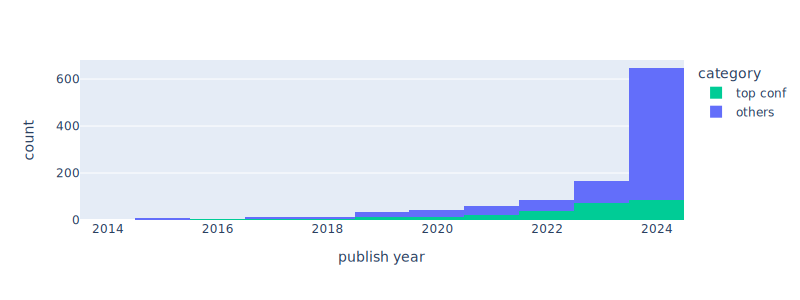

# AI for Mathematics Paper List

This is a periodically updated paper list of AI4Math.

Since papers can have different usages and significance for different people, I try to avoid only providing the ones that I personally find interesting. Instead, here is the long list that can be skimmed and filtered (more details below).

It is a by-product when I read papers, and is open sourced because I hope it may be a little bit helpful to others.

## Usage

### a. Direct reading

Here are some sub-lists that may be potentially interesting:

* [NeurIPS 2024](render/neurips_2024.md)
* [All top conferences](render/top_conferences.md)
* [Papers using proof assistants](render/proof_assistants.md) (Lean / Isabelle / ...)
* [Highly cited papers](render/highly_cited.md)
* [Papers highly cited by others in this field](render/highly_cited_ai4math_by_ai4math.md)
* [Recent ArXiv](render/recent_arxiv.md)

The full list of papers without any filtering is [here](render/all.md) (Markdown) / [here](https://huggingface.co/datasets/fzyzcjy/ai_math_paper_list) (Dataset).

### b. Custom filtering / RAG / ...

This list is also provided as a [dataset](https://huggingface.co/datasets/fzyzcjy/ai_math_paper_list), with each row being a paper. Example usages may possibly be:

* Filter the list: This can be done via keywords, labels, or even LLMs. For example, "citation > 50 OR top conference", or "filter papers if Llama3 thinks this contains things of my personal interest".
    * Supported labels: `citation_count`, `content_markdown`, `publish_info`, `publish_is_top`, `tldr_text`, `citation_count_filtered_math_and_top_conf`, `theorem_provers`, as well as normal `title`, `abstract`, `authors`, `date`, `url`, etc
* Feed it into RAG systems: Then, this dataset (or a chosen subset) can be a source of truth for LLMs when talking with it.
* Skim the missing pieces: For example, by excluding the papers already in your Zotero, the remaining may contain missing papers and may worth a skim.
* In the future, AI may be powerful enough to read these papers and output summarizations / trends / insights / ideas / ...
* ...

## Statistics

The number of AI4Math papers collected in this repository.

## Other Resources

Here are some other great resources, and many thanks to them!

* https://github.com/j991222/ai4math-papers
* https://github.com/zhaoyu-li/DL4TP
* https://github.com/lupantech/dl4math
* https://github.com/hijkzzz/Awesome-LLM-Strawberry
* https://docs.google.com/document/d/1kD7H4E28656ua8jOGZ934nbH2HcBLyxcRgFDduH5iQ0
